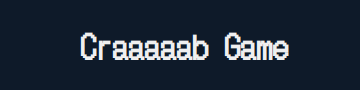
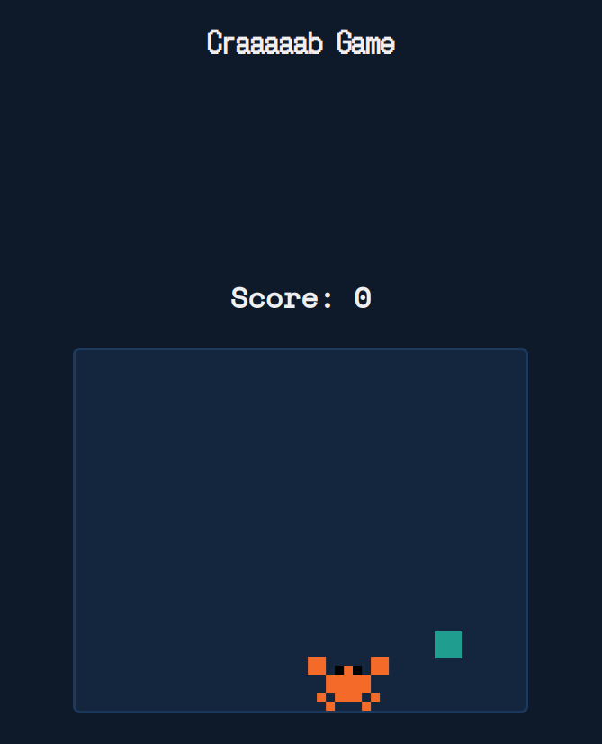

<div align="center">
    
    <h1 align="center">Crab Game</h1>
    <div>
        <a href="https://img.shields.io/badge/build-passing-brightgreen?logo=react"></a>
        <a href="https://img.shields.io/github/stars/Isaac-alencar/crab-game"></a>
        <a href="https://img.shields.io/github/forks/Isaac-alencar/crab-game"></a>
    </div>
</div>

# crab Game

Welcome to crab Game, a fun and interactive React-based game where you control a crab to eat delicious fruits!

## Table of Contents

- [Demo](#demo)
- [Features](#features)
- [Installation](#installation)
- [Usage](#usage)
- [Contributing](#contributing)
- [License](#license)

## Demo




## Features

- 🦀 Control a cute crab to navigate the game board.
- 🍎 Eat fruits to grow longer and score points.
- 🚫 Avoid collisions with the crab's own body and game boundaries.
- 🎮 Responsive and user-friendly interface.

## Installation

To set up crab Game locally, follow these steps:

1. Clone the repository:

   ```bash
   git clone https://github.com/Isaac-alencar/crab-game.git

   cd crab-game

   npm install
   ```

```

Then visit http://localhost:3000 in your browser to play the game.
```
# Contributing

If you'd like to contribute to Crabby Snake Game, follow these steps:

Fork the repository.
- Create a new branch: git checkout -b feature-name.
- Make your changes and commit them: git commit -m 'Add some feature'.
- Push to the branch: git push origin feature-name.
- Submit a pull request.

# License

This project is licensed under the MIT License.
